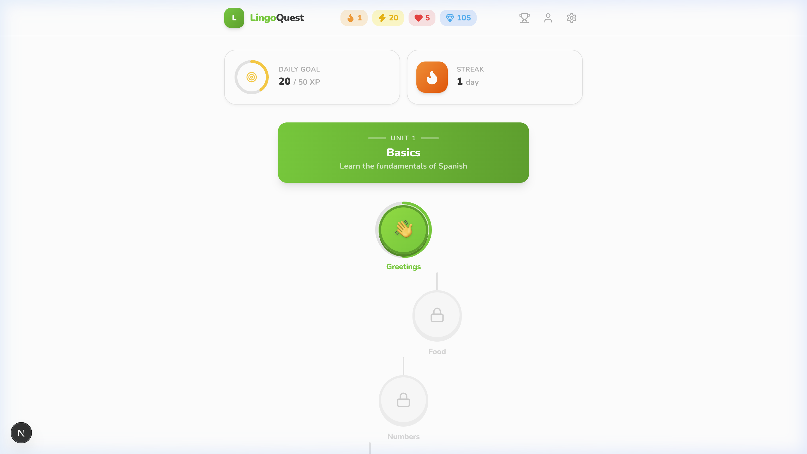
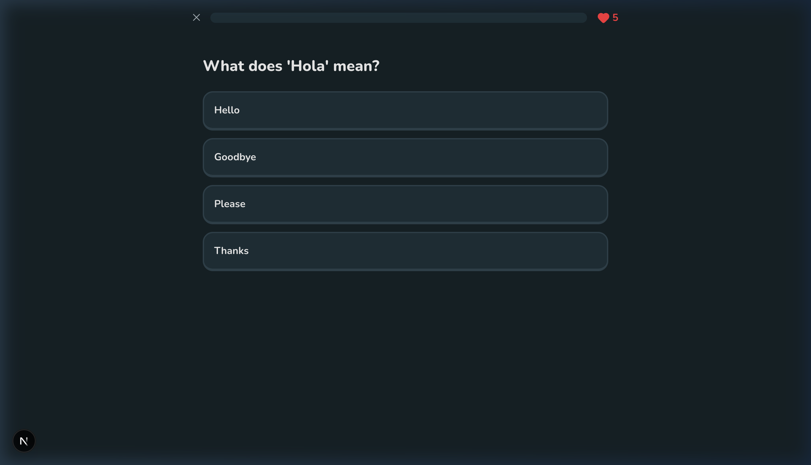
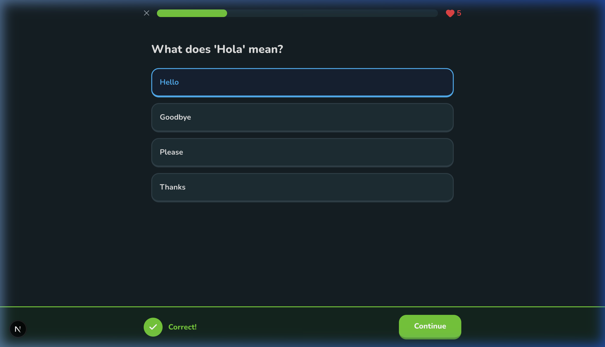
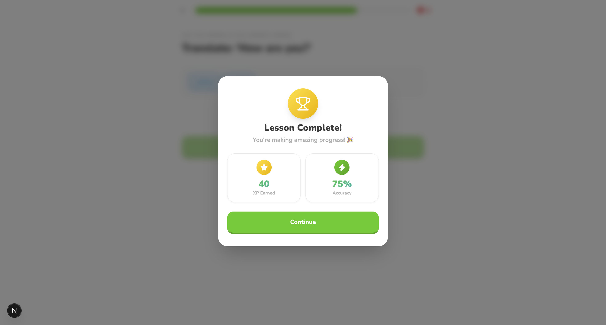
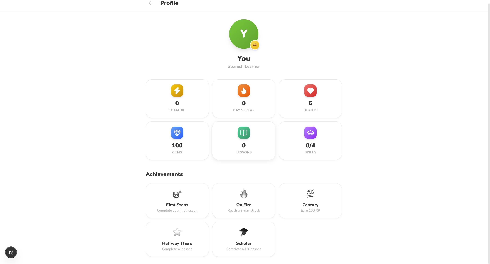
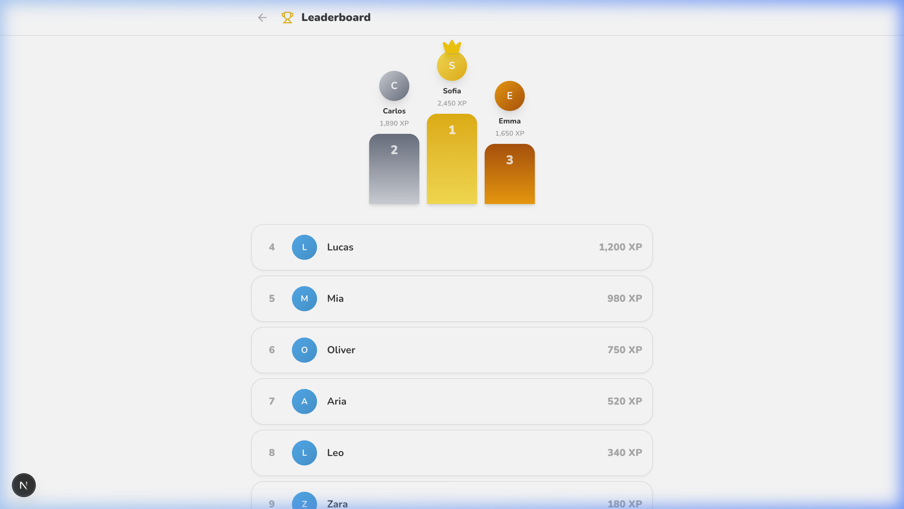
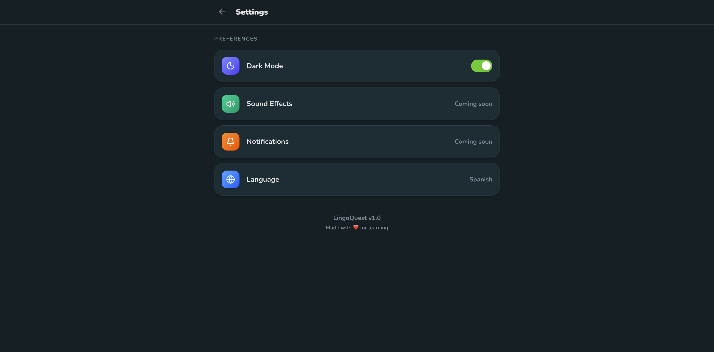

# LingoQuest 🦉

A gamified language learning platform inspired by modern language learning applications.

---

## Product Overview

**LingoQuest** is a full-stack, gamified web application designed to make language learning intuitive, engaging, and rewarding. Traditional language acquisition often suffers from high attrition rates due to dry, repetitive study methods. LingoQuest addresses this by combining cognitive learning techniques with proven gamification mechanics—such as daily streaks, XP points, heart penalties, and interactive exercise types.

Built with Next.js 16, FastAPI, and SQLAlchemy, LingoQuest showcases production-grade full-stack architecture, structured REST APIs, clean relational database design, state management, and a high-performance responsive UI with custom 3D design aesthetics.

---

## Project Statistics

| Metric | Count | Description |
|---|:---:|---|
| **Pages** | `5` | Home, Lesson Player, Profile, Leaderboard, Settings |
| **REST Endpoints** | `7` | Course navigation, exercise validation, user progress & leaderboard |
| **Database Tables** | `10` | Language, User, Unit, Skill, Lesson, Exercise, Option, Progress, Achievement |
| **Exercise Types** | `5` | Multiple Choice, Word Bank, Match Pairs, Fill in Blank, Type Answer |
| **Course Lessons** | `8` | Structured interactive lessons across 4 core skills |
| **Total Exercises** | `28` | Hand-crafted Spanish language learning exercises |
| **React Components** | `8` | Modular, reusable UI components |
| **Context Providers**| `2` | ThemeContext (Dark/Light mode) & UserContext (XP/Hearts/Streak) |

---

## Features

- 🎯 **Interactive Learning Path** — Visual zigzag skill tree displaying completed, active, and locked skill nodes.
- 📝 **5 Exercise Types** — Multiple Choice, Word Bank sentence builder, Match Pairs, Fill in the Blank, and Type the Answer.
- ❤️ **Hearts System** — Penalty system for incorrect answers with dedicated practice refill flows.
- ⚡ **XP & Leveling** — Earn experience points for correct responses and lesson completion bonuses.
- 🔥 **Daily Streak** — Consecutive day tracking with automated date validation and missed-day streak resets.
- 🏆 **Leaderboard** — Real-time user rankings featuring a custom 3D Top-3 podium (Gold 🥇, Silver 🥈, Bronze 🥉).
- 🎖️ **Achievements** — Progress-based badges dynamically unlocked upon reaching milestones.
- 🌙 **Dark Mode** — Full system dark/light theme toggling powered by custom CSS tokens.
- 📱 **Responsive Design** — Fully optimized for mobile, tablet, and desktop viewports.
- ✨ **Modern 3D Aesthetic** — Custom 3D pressable buttons, SVG circular progress rings, and fluid micro-animations.

---

## Design Principles

- **Gamified Learning** — Keeps users motivated through immediate feedback, streaks, and XP milestones.
- **Immediate Feedback** — Interactive slide-up notification bars give real-time validation on answers.
- **Clean Aesthetic** — Vibrant, distraction-free interface with custom 3D button interactions and glassmorphism.
- **Responsive Layout** — Adaptive design patterns ensuring seamless usability across all device sizes.
- **Reusable Component Architecture** — Modular React component hierarchy ensuring maintainability and scalability.
- **Accessible Interactions** — High contrast ratios, clear visual cues, and intuitive keyboard & touch targets.
- **Fluid Micro-Animations** — Smooth state transitions powered by Framer Motion.

---

## Tech Stack

### Frontend
| Technology | Purpose |
|---|---|
| Next.js 16 (App Router) | React application framework & routing |
| TypeScript | Strict static typing and code reliability |
| Tailwind CSS v4 | Utility-first styling & theme management |
| Axios | HTTP client for REST API communication |
| Framer Motion | Declarative motion and interactive animations |
| Lucide React | Modern SVG icon set |
| React Context API | Global state management for Theme and User Stats |

### Backend
| Technology | Purpose |
|---|---|
| FastAPI | High-performance Python REST API backend |
| SQLAlchemy | Relational ORM mapping |
| Pydantic | Strict data validation and schema serialization |
| SQLite | Lightweight relational database storage |

---

## Architecture

### Request & Data Flow

```
Browser (Client)
   │
   ▼
Next.js App Router (Frontend UI)
   │
   ▼
Axios (HTTP Client)
   │
   ▼
FastAPI (REST API Backend)
   │
   ▼
SQLAlchemy (ORM Data Access)
   │
   ▼
SQLite (Database Storage)
```

### Folder Structure

```
backend/                          frontend/src/
├── main.py                       ├── app/
├── database.py                   │   ├── layout.tsx
├── models.py                     │   ├── globals.css
├── schemas.py                    │   ├── page.tsx
├── seed.py                       │   ├── lesson/[id]/page.tsx
├── requirements.txt              │   ├── profile/page.tsx
└── routers/                      │   ├── leaderboard/page.tsx
    ├── home.py                   │   └── settings/page.tsx
    ├── lesson.py                 ├── components/
    ├── profile.py                │   ├── TopBar.tsx
    └── leaderboard.py            │   ├── SkillPath.tsx
                                  │   ├── SkillNode.tsx
                                  │   ├── LessonPlayer.tsx
                                  │   ├── ExerciseRenderer.tsx
                                  │   ├── FeedbackBar.tsx
                                  │   ├── ProgressBar.tsx
                                  │   └── Modal.tsx
                                  ├── context/
                                  │   ├── ThemeContext.tsx
                                  │   └── UserContext.tsx
                                  ├── lib/
                                  │   └── api.ts
                                  └── types/
                                      └── index.ts
```

---

## Database Schema

```
┌──────────┐     ┌──────────┐     ┌──────────┐     ┌─────────────┐     ┌──────────────┐
│ Language │────▶│   Unit   │────▶│  Skill   │────▶│   Lesson    │────▶│   Exercise   │
│──────────│     │──────────│     │──────────│     │─────────────│     │──────────────│
│ name     │     │ lang_id  │     │ title    │     │ skill_id    │     │ type         │
│ code     │     │ title    │     │ icon     │     │ order       │     │ prompt       │
│ flag_emj │     │ order    │     │ order    │     └─────────────┘     │ correct_ans  │
└──────────┘     └──────────┘     └──────────┘                         └──────────────┘
      │                                                                       │
┌──────────┐     ┌──────────────┐     ┌──────────────┐                ┌──────────────┐
│   User   │────▶│ UserProgress │     │ Achievement  │                │ExerciseOption│
│──────────│     │──────────────│     │──────────────│                │──────────────│
│ xp       │     │ lesson_id    │     │ completed    │                │ text         │
│ hearts   │     │ completed    │     │ condition    │                │ is_correct   │
│ gems     │     └──────────────┘     └──────────────┘                │ match_text   │
│ streak   │                                │                         └──────────────┘
└──────────┘                        ┌───────▼──────┐
                                    │UserAchievmnt │
                                    │──────────────│
                                    │ user_id      │
                                    │ achievement  │
                                    └──────────────┘
```

**10 Tables** — `Language`, `User`, `Unit`, `Skill`, `Lesson`, `Exercise`, `ExerciseOption`, `UserProgress`, `Achievement`, `UserAchievement`.

---

## API Documentation

| Method | Endpoint | Description |
|--------|----------|-------------|
| `GET` | `/api/home` | Fetches user stats, active language, and unit skill path with statuses |
| `GET` | `/api/lesson/{id}` | Retrieves exercise data and options for a specific lesson |
| `POST` | `/api/lesson/answer` | Validates answer accuracy and deducts hearts on failure |
| `POST` | `/api/lesson/complete` | Marks lesson as complete, awards XP, and evaluates achievements |
| `GET` | `/api/profile` | Fetches profile stats, completion counts, and unlocked achievements |
| `GET` | `/api/leaderboard` | Returns ranked user leaderboard sorted by total XP |
| `POST` | `/api/practice/refill` | Restores user hearts back to maximum (5 hearts) |

---

## Installation

### Prerequisites
- **Python**: 3.12+
- **Node.js**: 20+
- **npm**: 10+

### 1. Backend Setup
```bash
cd backend
pip install -r requirements.txt
```

### 2. Frontend Setup
```bash
cd frontend
npm install
```

---

## Running Locally

### 1. Start the Backend Server (Port 8000)
```bash
cd backend
uvicorn main:app --reload
```
*Note: The SQLite database is automatically created and seeded on initial startup.*

### 2. Start the Frontend Application (Port 3000)
```bash
cd frontend
npm run dev
```

Open [http://localhost:3000](http://localhost:3000) in your web browser.

---

## Screenshots

### Learning Path & Language Header


### Interactive Lesson Player & Exercises


### Real-Time Feedback Slide-Up


### Lesson Completion Celebration


### User Profile & Achievements


### 3D Top-3 Leaderboard Podium


### Settings & Dark Mode Toggle


---

## Deployment

LingoQuest is architected for simple cloud deployment:

- **Frontend Application**: Deployed to [Vercel](https://vercel.com) using standard Next.js build workflows.
- **Backend API**: Deployed to [Render](https://render.com) or [Railway](https://railway.app) using Uvicorn ASGI runner.
- **Database Layer**: SQLite file-based storage (easily migratable to PostgreSQL on Supabase or Neon via SQLAlchemy connection strings).

---

## Future Improvements

### Learning Experience
- 🎤 **Speech Recognition** — Voice input validation for pronunciation practice.
- 📈 **Adaptive Difficulty** — Dynamic exercise selection based on historical user performance.

### Social & Gamification
- 👥 **Friends System** — Add friends and compare learning milestones.
- 🛡️ **Leagues & Clubs** — Weekly competitive promotion leagues.

### Platform Architecture
- 🔐 **Authentication** — Multi-user JWT and OAuth2 integration.
- 🐘 **PostgreSQL Migration** — Production database setup with Redis caching for leaderboard rankings.
- 🌍 **Multi-Language Expansion** — Expanding content models across German, French, and Japanese.

---


